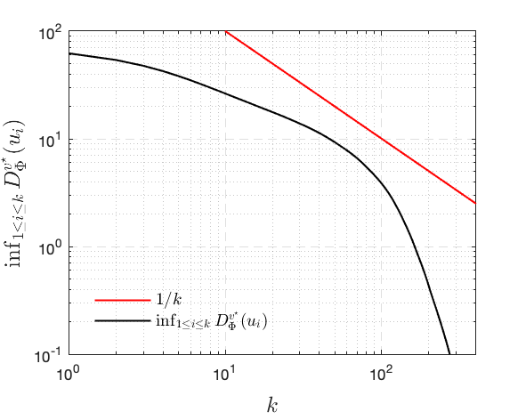
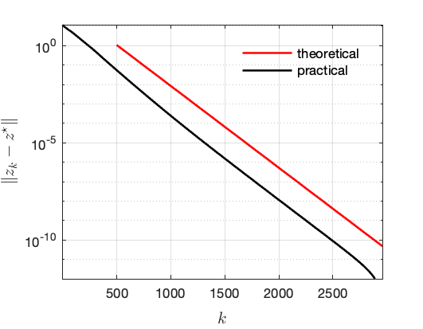
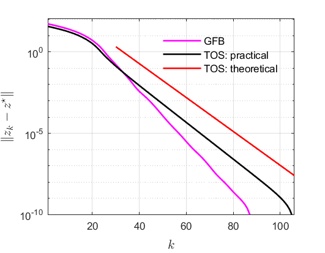

# Rate-FDR

Matlab code to reproduce the results of the paper

[Convergence Rates of Forward--Douglas--Rachford Splitting Method](https://jliang993.github.io/assets/files/journal/rate-fdr.pdf)

Cesare Molinari, Jingwei Liang, Jalal Fadili,  2018

## Global and local convergence of FDR

Consider the problem
$$
\min_{x\in\mathbb{R}^n} \mu_{1} \|x\|_1 + \mu_2 \|\nabla x\| + \frac{1}{2} \|{\mathcal{K}x- f}\|^2 ,
$$
where $\mathcal{K}$ is a random Gaussian matrix. 

 Bregman divergence         |  $\|z_k - z^\star\|$
:-------------------------:|:-------------------------:
  |  

## Non-stationary FDR

Four different non-stationary FDR iterations are considered:
$$
\begin{aligned}
	\textrm{Case 1:}&~ \gamma_k = (1 + \tfrac{1}{k^{1.1}})\beta  ,~~&
	\textrm{Case 2:}&~ \gamma_k = (1 + \tfrac{1}{k^{2}})\beta  , \\
	\textrm{Case 3:}&~ \gamma_k = (1 + 0.999^k)\beta  ,~~&
	\textrm{Case 4:}&~ \gamma_k = (1 + 0.5^k)\beta  .
\end{aligned}
$$

## GFB and TOS

Generalised Forward--Backward and Three-operator splitting are applied to solve the non-negativity constrained matrix completion problem, which is described below: 
$$
\min_{x\in\mathbb{R}^n} \mu \|x\|_* + \iota_{\mathbb{R}^n_+} (x) + \frac{1}{2} \|{\mathcal{K}x- f}\|^2  .
$$
$\mathcal{K}$ now is a sub-sampling matrix. 

